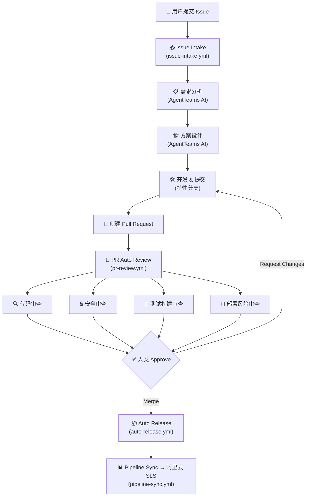

# K8s Log Doctor 🔍

智能 Kubernetes 日志诊断工具 - 自动识别常见错误模式，给出修复建议

## ✨ 功能特性

- 🎯 **智能模式识别** - 自动识别 10+ 种常见 K8s 错误模式
- 📊 **严重程度分级** - CRITICAL/HIGH/MEDIUM/LOW 四级分类
- 💡 **修复建议** - 针对每个问题提供具体的解决方案
- 🔌 **多种输入方式** - 支持文件、kubectl、标准输入
- 📦 **开箱即用** - 零配置，单文件即可运行
- 🎨 **多格式输出** - 支持文本、JSON 和结构化 JSON 格式
- 🤖 **CI 友好** - 标准退出码，适合自动化流水线集成

## 🚀 快速开始

### 安装

```bash
# 方式1: 直接下载运行
curl -O https://raw.githubusercontent.com/yourusername/k8s-log-doctor/main/k8s_log_doctor.py
chmod +x k8s_log_doctor.py

# 方式2: pip 安装
pip install k8s-log-doctor
```

### 使用示例

```bash
# 1. 分析 Pod 日志
k8s-log-doctor -p my-pod -n my-namespace

# 2. 分析日志文件
k8s-log-doctor -f /var/log/pod.log

# 3. 从标准输入读取
kubectl logs my-pod | k8s-log-doctor

# 4. 输出 JSON 格式（便于集成）
k8s-log-doctor -f pod.log -o json

# 5. 指定容器（多容器 Pod）
k8s-log-doctor -p my-pod -c my-container

# 6. 结构化 JSON 输出（含摘要统计，CI 友好）
k8s-log-doctor -f pod.log --json
```

## 📋 支持的错误模式

| 模式 | 严重程度 | 说明 |
|------|---------|------|
| OOMKilled | 🔴 CRITICAL | 容器内存不足被杀死 |
| CrashLoopBackOff | 🔴 CRITICAL | 容器反复崩溃重启 |
| ImagePullError | 🟠 HIGH | 镜像拉取失败 |
| LivenessProbeFailed | 🟠 HIGH | 健康检查失败 |
| DiskPressure | 🔴 CRITICAL | 磁盘空间不足 |
| NetworkError | 🟠 HIGH | 网络连接问题 |
| PermissionDenied | 🟠 HIGH | 权限不足 |
| ConfigError | 🟡 MEDIUM | 配置错误 |
| Timeout | 🟡 MEDIUM | 请求超时 |
| PanicError | 🔴 CRITICAL | 程序崩溃 |

## 📊 输出格式

### 文本输出（默认）

```
============================================================
🔍 K8s Log Doctor 诊断报告
============================================================

发现 2 个问题:

🔴 [1] OOMKilled
   严重程度: CRITICAL
   问题描述: 容器因内存不足被杀死
   置信度: 95%

   💡 建议:
      1. 增加Pod的memory limit
      2. 检查应用是否有内存泄漏
      3. 优化应用内存使用
      4. 考虑使用HPA自动扩缩容

   📝 相关日志 (前3行):
      2024-01-15 10:23:45 OOMKilled: container exceeded memory limit

🟠 [2] LivenessProbeFailed
   严重程度: HIGH
   问题描述: 健康检查失败
   置信度: 85%

   💡 建议:
      1. 检查应用是否正常启动
      2. 调整probe的timeout和period
      3. 验证健康检查端点
      4. 增加initialDelaySeconds

============================================================
```

### 结构化 JSON 输出（`--json`）

使用 `--json` 参数输出包含完整摘要统计的结构化 JSON，适合程序化处理和 CI 集成：

```bash
k8s-log-doctor -f pod.log --json
```

输出示例：

```json
{
  "checks": [
    {
      "pattern_name": "OOMKilled",
      "severity": "critical",
      "description": "容器因内存不足被杀死",
      "suggestion": "1. 增加Pod的memory limit\n2. 检查应用是否有内存泄漏\n3. 优化应用内存使用\n4. 考虑使用HPA自动扩缩容",
      "matched_lines": [
        "2024-01-15 10:23:45 OOMKilled: container exceeded memory limit"
      ],
      "confidence": 0.95
    },
    {
      "pattern_name": "LivenessProbeFailed",
      "severity": "high",
      "description": "健康检查失败",
      "suggestion": "1. 检查应用是否正常启动\n2. 调整probe的timeout和period\n3. 验证健康检查端点\n4. 增加initialDelaySeconds",
      "matched_lines": [
        "2024-01-15 10:23:50 Liveness probe failed: connection refused"
      ],
      "confidence": 0.85
    }
  ],
  "status": "issues_found",
  "error_message": null,
  "summary": {
    "total_checks": 2,
    "issues_count": 2,
    "severity_breakdown": {
      "critical": 1,
      "high": 1,
      "medium": 0,
      "low": 0,
      "info": 0
    }
  }
}
```

**字段说明：**

| 字段 | 类型 | 说明 |
|------|------|------|
| `checks` | array | 检查项列表，每项包含 `pattern_name`、`severity`、`description`、`suggestion`、`matched_lines`、`confidence` |
| `status` | string | 总体状态：`ok`（无问题）、`issues_found`（发现 CRITICAL/HIGH 问题）、`error`（工具出错） |
| `error_message` | string\|null | 错误信息，仅在工具自身出错时有值 |
| `summary` | object | 摘要统计，包含 `total_checks`、`issues_count`、`severity_breakdown` |

> **注意：** `-o json` 仍然可用，输出为旧版数组格式（向后兼容）。`--json` 是新增的结构化输出模式。

## 🔢 退出码

k8s-log-doctor 使用 CI 友好的标准退出码：

| 退出码 | 含义 | 说明 |
|--------|------|------|
| `0` | 无问题 | 未发现 CRITICAL 或 HIGH 级别问题（MEDIUM/LOW/INFO 不影响退出码） |
| `1` | 发现问题 | 存在 CRITICAL 或 HIGH 级别问题 |
| `2` | 工具错误 | 文件不存在、参数错误、未预期异常等工具自身错误 |

使用 `--json` 时，即使工具出错（退出码 2），也会输出合法的 JSON（`status: "error"`），便于程序化处理。

## 🔧 高级用法

### 与 CI/CD 集成

#### GitHub Actions

```yaml
name: Log Diagnosis

on:
  workflow_dispatch:
  schedule:
    - cron: '0 */6 * * *'  # 每6小时运行一次

jobs:
  diagnose:
    runs-on: ubuntu-latest
    steps:
      - name: Checkout
        uses: actions/checkout@v4

      - name: Setup kubectl
        uses: azure/setup-kubectl@v3

      - name: Download k8s-log-doctor
        run: |
          curl -O https://raw.githubusercontent.com/yourusername/k8s-log-doctor/main/k8s_log_doctor.py
          chmod +x k8s_log_doctor.py

      - name: Analyze pod logs
        run: |
          # 获取所有 Pod 并分析日志
          for pod in $(kubectl get pods -n production -o name); do
            echo "=== Analyzing ${pod} ==="
            kubectl logs ${pod} -n production --tail=500 | \
              python k8s_log_doctor.py --json > diagnosis.json
            
            # 使用退出码判断
            EXIT_CODE=$?
            if [ $EXIT_CODE -eq 1 ]; then
              echo "::warning::Severe issues found in ${pod}"
            elif [ $EXIT_CODE -eq 2 ]; then
              echo "::error::Tool error while analyzing ${pod}"
            fi
          done

      - name: Check for critical issues
        run: |
          # 分析指定 Pod 并在发现问题时阻断流水线
          kubectl logs my-critical-pod -n production --tail=1000 | \
            python k8s_log_doctor.py --json | tee diagnosis.json
          
          # 根据退出码决定是否阻断
          EXIT_CODE=${PIPESTATUS[1]}
          if [ $EXIT_CODE -eq 1 ]; then
            echo "❌ Critical issues detected! Blocking deployment."
            exit 1
          fi
```

#### GitLab CI

```yaml
log-diagnosis:
  stage: test
  script:
    - curl -O https://raw.githubusercontent.com/yourusername/k8s-log-doctor/main/k8s_log_doctor.py
    - kubectl logs $TARGET_POD -n $NAMESPACE --tail=1000 | 
        python k8s_log_doctor.py --json > diagnosis.json
    - |
      EXIT_CODE=$?
      if [ $EXIT_CODE -eq 1 ]; then
        echo "Severe issues found, failing pipeline"
        exit 1
      fi
  artifacts:
    paths:
      - diagnosis.json
    when: always
  allow_failure: false
```

### 批量分析

```bash
# 分析多个 Pod
for pod in $(kubectl get pods -o name); do
  echo "Analyzing $pod..."
  k8s-log-doctor -p ${pod#pod/} -n production
done
```

## 🧪 测试

```bash
# 安装测试依赖
pip install pytest

# 运行全部测试
pytest tests/ -v
```

## 💰 Pro 版本

免费版包含基础诊断功能，Pro 版本提供：

- 🤖 **AI 智能分析** - 基于大模型的深度诊断
- 📈 **趋势分析** - 历史日志趋势对比
- 🔔 **告警集成** - 自动发送告警到钉钉/飞书/企业微信
- 📊 **可视化报告** - 生成 HTML 诊断报告
- 🎯 **自定义规则** - 支持自定义错误模式
- 📞 **技术支持** - 专属技术支持群

**价格**: ¥29/月 或 ¥299/年

[👉 升级到 Pro 版本](https://your-payment-link.com)

## 🤝 贡献

欢迎提交 Issue 和 Pull Request！

## 🤖 自动化研发流水线

本项目已接入 GitHub Actions + AgentTeams AI 自动化研发流水线。当你在 Issues 中提交新需求后，AgentTeams AI 团队会自动完成：需求分析 → 方案设计 → 开发（创建特性分支并提交变更）→ 四维审查（代码审查 / 安全审查 / 测试构建审查 / 部署风险审查），人类 approve 后 merge，merge 后自动发布 Release。

### 工作流概览

| 工作流文件 | 名称 | 职责 |
|-----------|------|------|
| issue-intake.yml | Issue Intake | Issue 创建/重开时自动触发 AgentTeams 研发流水线，分配开发任务 |
| pr-review.yml | PR Auto Review | PR 创建时自动触发四维 AI 审查（代码/安全/测试构建/部署风险）并评论审查结论 |
| auto-release.yml | Auto Release | 代码合并到 main 后自动创建 patch 版本 Release |
| pipeline-sync.yml | Pipeline Sync | 定时将流水线状态同步到阿里云 SLS，实现全链路可观测 |

### 端到端流水线



## 📄 许可证

MIT License

## 👨‍💻 作者

由艾玛（AI助手）开发，为 K8s 运维人员而生 💪
